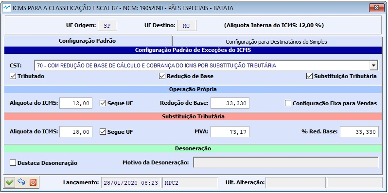

##### Se ainda não conhece a estrutura de telas do sistema, clique em <a href="https://mpc2erp.github.io/Pages/Telas" target="_blank">Telas do Sistema MPC²-ERP</a>

# Cadastro de Classificações Fiscais
 

Classificação Fiscal é uma situação tributária parametrizada a partir de um NCM (Nomenclatura Comum do Mercosul). As Classificações são necessárias pelo motivo de uma mesma NCM poder ter tributaçlões diferentes.
Para conhecimento, as leis que definem as regras do IPI são de competência do Governo Federal, que vive criando excessões como incentivo à produção industrial. Já as leis do ICMS, cada estado tem sua legislação própria que regem as operações realizadas dentro do estado (Estadual). Assim como as opeações tributadas pela Substituição Tributária do ICMS, conhecida como ICMS-ST. Porém, existe ainda um legislação Federal do ICMS, que fica a cargo do Senado do Brasil, que estabelece as regras para as operações Interestaduais.

As exceções conhecidas até o momento, são sempre vinculadas a uma NCM (Nomenclatura Comum do Mercosul). Sendo assim, uma NCM pode ter várias situações tributárias diferentes. Este conjunto de informações chama-se Classificações Fiscais.

Além de cadastrar o código da NCM també se cadastra o comportamento do IPI, o CEST Padrão, CST do IPI, PIS e COFINS e as variações de tributação de ICMS por estado. 

É necessário conhecimento dos conceitos tributários envolvidos para que se trabalhe de maneira correta com as informações contidas em cada Natureza de Operação.
Recomendamos que seja acompanhado pelo(s) profissional(ais) do depatamento contábil ou escritório de contabilidade

 

As informações a serem inseridas em uma Classificação Fiscal, como pode-se ver na tela acima, são:

   - Código da NCM da Classificação
   - Código da Excessão da TIPI (Tabela do IPI)
   - Descrição Interna e Descrição na TIPI
   - CEST (Código Espedificador da Substituição Tributária)
   - CST do IPI
   - CST do PIS
   - CST do COFINS
   - Alíquotas de Tributação Média
   
   Obs. : CST = Código da Situação Tributária

  

Outra parte importante vinculada à Classificação Fiscal, são as exceções do ICMS.
Repare na imagem acima que na lista dos estados, estão em preto que tem a Tributação Padrão, e os estados que tem alguma exceção vinvulada ao NCM em questão, em vermelho.
Caso a linha esteja vermelha (Exceção) e o usuário deseje excluí-la, basta clicar na linha em questão, cliclar no sinal de Menos na parte inferior da tela, e ao confirmar, a tributação voltará para o Padrão.
Para configurar uma exceção, clique na linha do estado desejado e clique no Lápis na parte inferior da tela (ou duplo clique). Este ato abrira a tela de Exceções:

 

Exceção ou não, para o Sistema MPC², os parâmetros tem que seguir OBRIGATORIAMENTE as diretrizes da CST do ICMS. Ou seja, só nas CSTs que tratem ST ela será acatada. Só nas CSTs que tenham Redução de Base, elas poderão ser configuradas, etc ...

Nota Importante: As alterações das configurações tributárias NÃO alteram os documentos gerados anteriormente a mudança, e sim, apenas os novos documentos.

Para o bom funcionamento de um sistema, é imprescindível que as informações dos cadastros sejam de boa qualidade.
### Crie o hábito de realizar revisões periódicas nos seus cadastros.
# A MPC² Sistemas não se responsabiliza por Notas Fiscai tributadas erradas por má parametrização. Todas as alterações ficam registradas como eram anteriormente, como ficaram e quem alterou.

