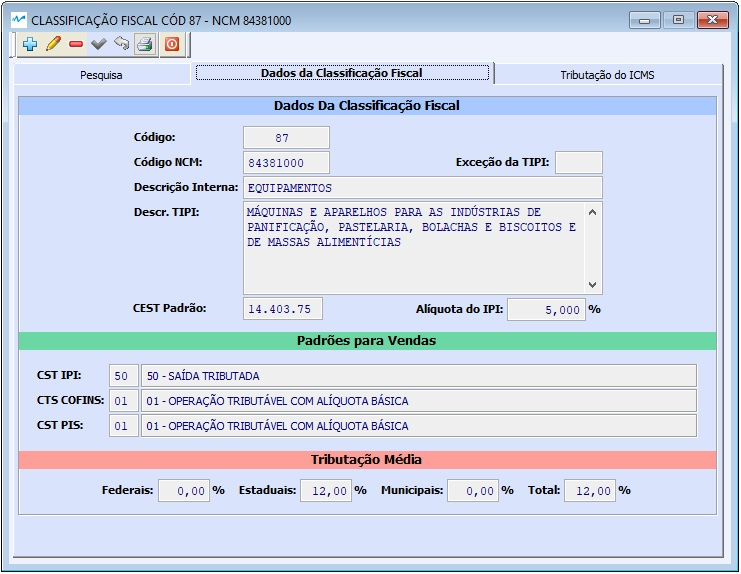
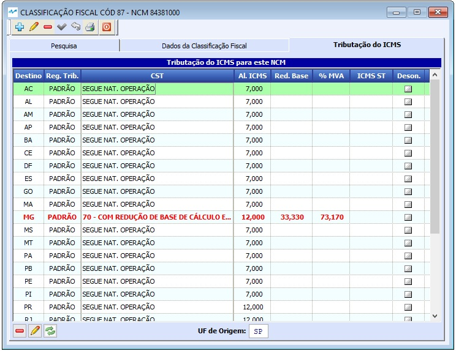

##### Se ainda não conhece a estrutura de telas do sistema, clique em <a href="https://mpc2erp.github.io/Pages/Telas" target="_blank">Telas do Sistema MPC²-ERP</a>

# Cadastro de Classificações Fiscais
 

A Classificação Fiscal é o cadastro do conjunto de informações relacionados à NCM (Nomenclatura Comum do Mercosul), e uma série de configurações, que podem ser alteradas conforme o NCM. Nela, além de cadastrar o código da NCM també se cadastra o comportamento do IPI, o CEST Padrão, CST do IPI, PIS e COFINS e as variações de tributação de ICMS por estado, normalmente vinculados à NCM.

Este cadastro é muito importante e deve ser feito com critério, pois é nele que se define parte da tributação e códigos legas legal de uma operação.

 

As informações a serem inseridas em uma Classificação Fiscal, como pode-se ver na tela acima, são:
    - Código da NCM da Classificação
    - Código da Excessão da TIPI (Tabela do IPI)
    - Descrição Interna e Descrição na TIPI
    - CEST (Código Espedificador da Substituição Tributária)
    - CST do IPI
    - CST do PIS
    - CST do COFINS
    

 

A Operação (de venda, remessa, etc ...) segue aquilo que está parametrizado na Natureza para calcular impostos e tudo mais.

 

 

Para o bom funcionamento de um sistema, é imprescindível que as informações dos cadastros sejam de boa qualidade.
### Crie o hábito de realizar revisões periódicas nos seus cadastros.

