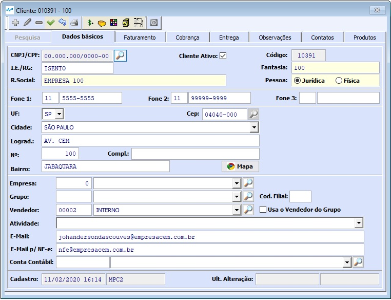
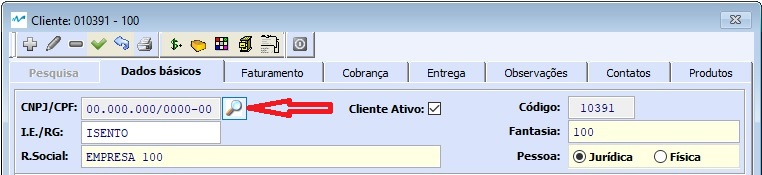
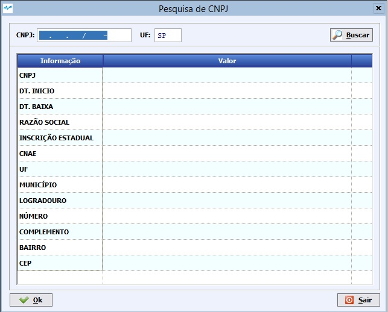
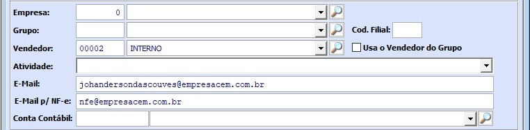
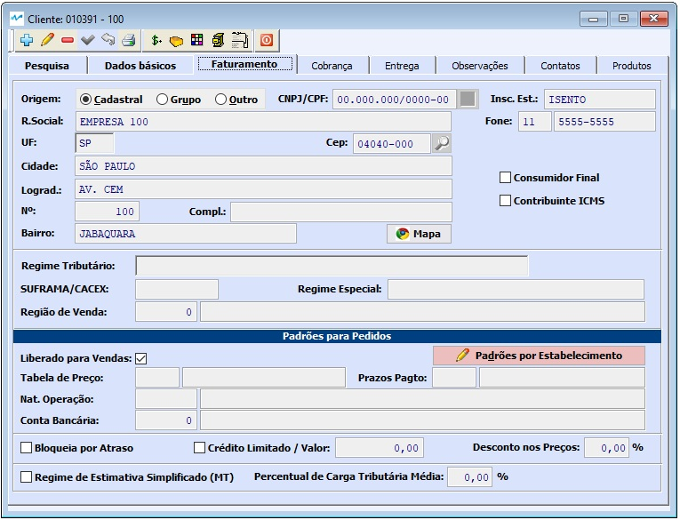
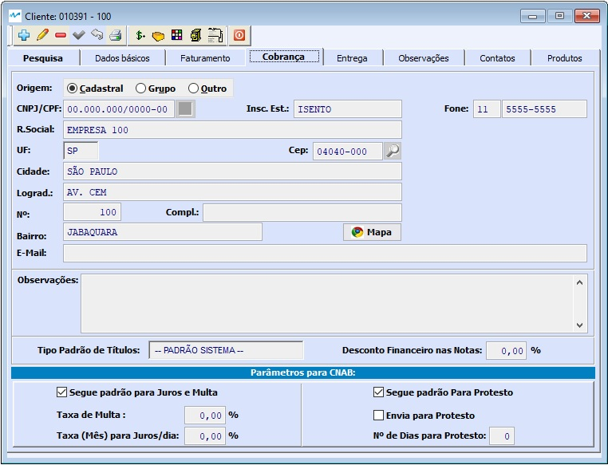
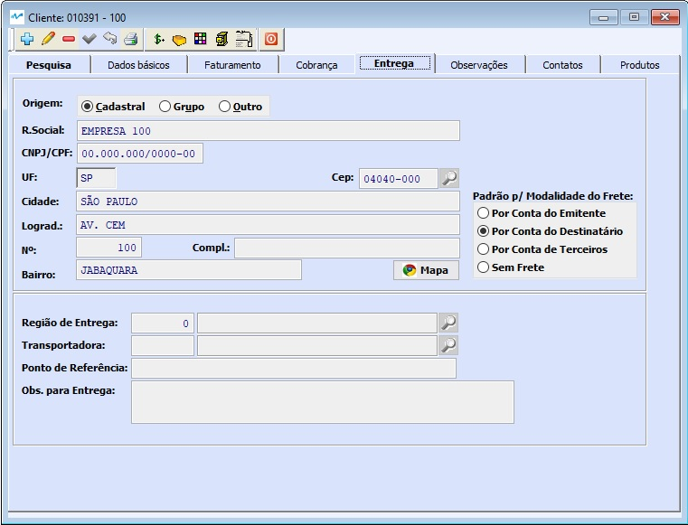
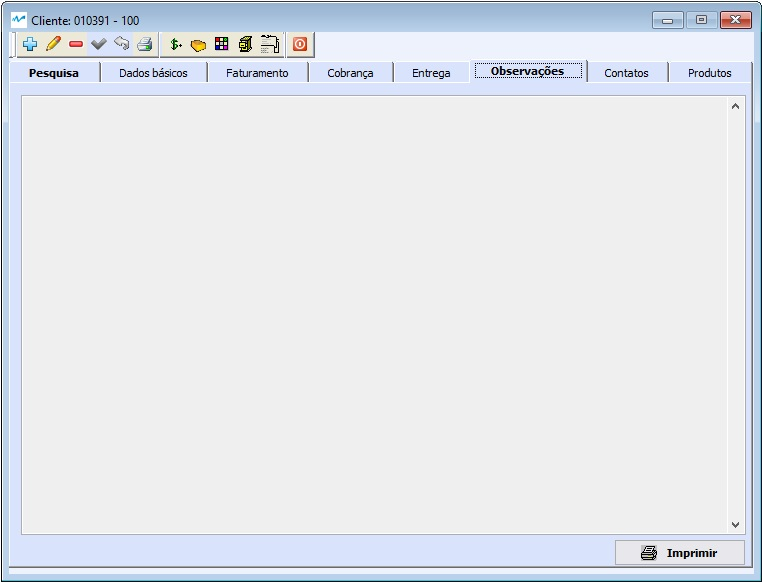
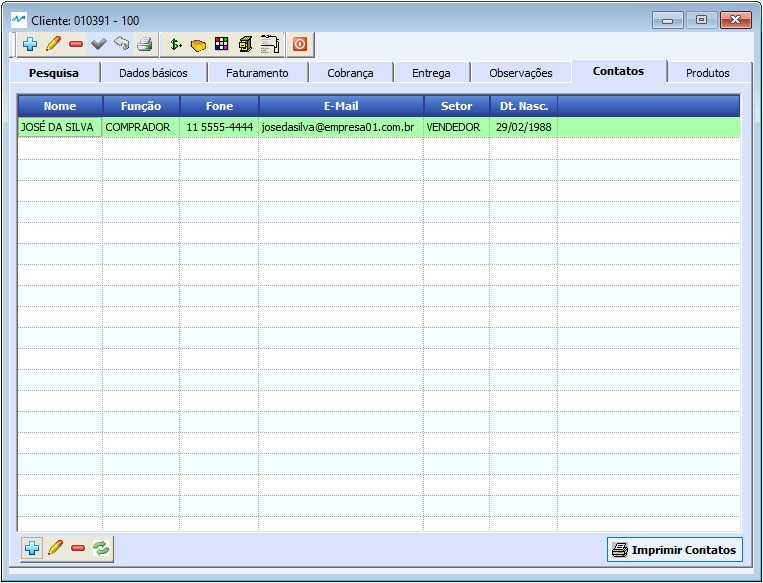
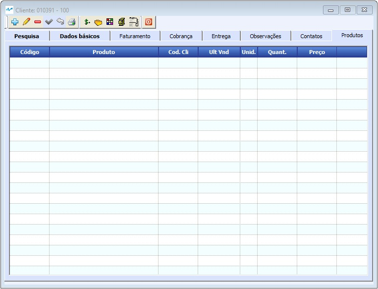

##### Se ainda não conhece a estrutura de telas do sistema, clique em <a href="https://mpc2erp.github.io/Pages/Telas" target="_blank">Telas do Sistema MPC²-ERP</a>

# Cadastro de Clientes
 
O Cadastro de Clientes, a pesar no nome sugerir um cadastro com dados básicos dos clientes das empresas, é uma cadastro muito importante, onde além dos dados comerciais de cada cliente, são definidos uma série de parâmetros que servirão de Padrões para as negociações futoras com os clientes. Deve ser realizado com critério e, se possível, acompanhamento do Departamento Fiscal.

A tela do Cadastro de Clientes é dividida em 8 abas, sendo as rotineiras Pesquisa e Dados Básicos seguidos ainda das abas Faturamento, Cobrança, Entrega, Observações, Contatos e Produtos.

 

Na aba Dados básicos, onde tudo se inicia pelo Documento único do cliente, podento ser CNPJ, para pessoas jurídicas ou CPF, para pessoas físicas. Caso o cliente a ser cadastrado seja pessoa jurídica contribuinte do ICMS (Tem Inscrição Estadual), é possível realizar a pesquisa dos dados no SEFAZ para facilitar / acertar o cadastro, clicando no ícone Lupa, localido à direita do CNPJ/CPF.

 

Ao clicar, será apresentada a tela para consulta.

 

Devereá ser informado o CNPJ desejado e a UF pra consulta. Sendo válido e localizado, os dados disponíveis no SEFAZ serão apresentados na tela. Clicando em [OK], esses dados serão importados para o Cadastro do Cliente.

 

Outros dados ainda na aba de Dados básicos que precisam ser entendidos:

  - Empresa: quando tem mais de um estabelecimento, este campo pode ser preenchido para indicar qual é a Empresa padrão para venda.
  - Grupo: campo utilizado para identificação de Grupos Corporativos, indicando qual o código de Cliente que aponta para a Matriz
  - Vendedor: representante comercial que atende o cliente
  - e-Mail, e-Mail para NF-e e Conta Contábil: dados cadastrais

##### Aba Faturamento

 

A primeira informação que encontramos é a Origem do Endereço do endereço de Faturamento, que pode ser Cadastral (Opção Padrão), que traz o endereço do cadastro definido na aba de Dados Básicos, Grupo, que traz o endereço da matriz do grupo, indicado na aba de Dados Básicos, ou Outro, que abre os campos para digitação. 
Flag de Contribuinte do ICMS, caso não seja, obrigatóriamente se torna um Consumidor Final e caso seja, Flag de Consumidor Final. Neste caso, é um indicador de padrões. Este cliente compra PREDOMINANTEMENTE desta forma.
Mais abaixo, o Regime Tributário do cliente, Suframa/CACEX e Regime Especial caso haja. Região de venda, para quem usa esta triangulação.
Padrões para Pedidos é muito importante pois mexe em parâmetros que podem alterar o preço final e prazo de pagamento do Cliente.

   - Liberado para Vendas: Indica se este cliente é liberado ou bloqueado
   - Tabela de Preços: Tabela de preços PADRÂO para este cliente
   - Natureza de Operação: Indica a natureza PADRÂO para as operações com o cliente
   - Conta Bancária: Quando a Empresa trabalha com vários bancos, indica no cadastro do Cliente, qual é o banco/conta que deve gerar as cobranças (boletos).
   
##### * Repare no botão Padrões por Estabelecimento.
   Este botão é utilizado quando a Empresa possui mais de um estabelecimento, para definir os padrões da venda de cada estabelecimento para este Cliente.

   - Bloqueia por Atraso: Indica se o faturamento deve ou não continuar livre para este cliente, caso ele se torne inadimplente.
   - Limite de crédito: Especifica o valor máximo da carteira de títulos em aberto para este Cliente.
   - Desconto nos Preços: Desconto específico do Cliente nos preços praticados na Tabela de Venda indicada.
   - Se gegue o Regime de Estimativa Simplificado, só serve para Cliente do MT.
   - Percentual de Carga Tributária Média: Informado quando deferente do padrão.
   
##### Aba Cobrança

 

Assim como na aba Faturamento, a primeira informação que encontramos é a Origem do Endereço do endereço de Cobrança, que pode ser Cadastral (Opção Padrão), que traz o endereço do cadastro definido na aba de Dados Básicos, Grupo, que traz o endereço da matriz do grupo, indicado na aba de Dados Básicos, ou Outro, que abre os campos para digitação.
Nesta aba, ainda pede ser definido:

   - Tipo de Título padrão: Boleto, Cartão, etc ...
   - Parâmetros para CNAB
   Os Padrões para CNAB como taxa de multa e alíquota de juros mês e se protesta ou não e em quanto tempo, são definidos no Cadastro de Contas correntes. Aqui no cadastro de Clientes, pode-se estabelecer exceções para os padrões. Repare que por defalult, o cadastro do Cliente vem com os Flags Segue Padrão para juros e multa e Segue Padrão para protesto marcados. Isso indica que devem ser utilizados os valores definidos como padrão, no Cadastro de Contas Correntes. Porém, se for interesse da empresa dar uma tratativa especial para um determinado Cliente por ser muito bom ou muito ruim, basta desmarcar o Flag de Segue Padrão, e determinar os valores que serão usados especificamente para este Cliente.
   
##### Aba Entrega

 
   
Assim como na aba Faturamento, a primeira informação que encontramos é a Origem do Endereço do endereço de Cobrança, que pode ser Cadastral (Opção Padrão), que traz o endereço do cadastro definido na aba de Dados Básicos, Grupo, que traz o endereço da matriz do grupo, indicado na aba de Dados Básicos, ou Outro, que abre os campos para digitação.
Nesta aba, ainda pede ser definido:

   - Padrão para Modalidade do Frete: Sugere quem é o Pagador padrão
   - Região de Entrega: O Cadastro da Região de Entrega é um facilitador para distribuição de carga.
   - Transportadora: Indica qual a Transportadora Padrão deste Cliente.
   - Obs. para entrega: Dados internos de observações pertinentes à entrega

##### Aba Observações

 

Local destinado à observações internas sobre o cliente. Estas informações não circulam em pedidos, notas, etc ... Sendo apenas para referência interna, do tipo "Vencimentos apenas nas sextas-feiras", "Só recebem mercadorias nas quitas-feiras" e assim por diante.

##### Aba Contatos

 

Na aba contatos são gerenciados os doncatos dentro do cliente, não havendo limite para o número de contatos.

##### Aba Produtos

 

Nesta aba são apresentados todos os produtos que já foram negociados com este cliente, incluindo valores e quantidades.

   

