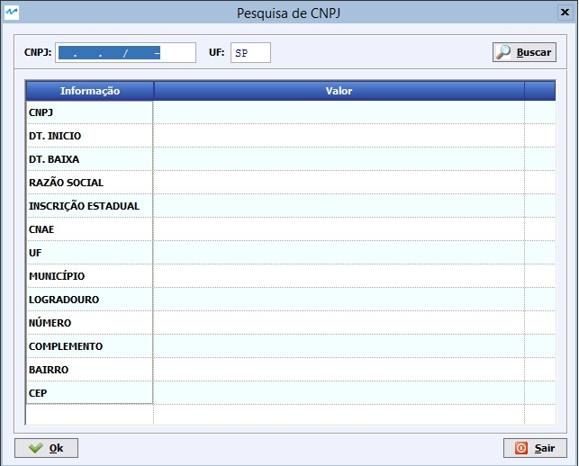

##### Se ainda não conhece a estrutura de telas do sistema, clique em <a href="https://mpc2erp.github.io/Pages/Telas" target="_blank">Telas do Sistema MPC²-ERP</a>

# Cadastro de Fornecedores
 
O Cadastro de Fornecedores é o local onde armazenamos as informações de cada fornecedor da empresa, além de uma série de parâmetros que servirão de Padrões para as negociações futoras. Este cadastro deve ser realizado com critério e, se possível, acompanhamento do Departamento Fiscal, pois estes parâmetros influenciam os créditos tributários das compras.

A tela do Cadastro de Fornecedores é dividida em 3 abas, sendo as rotineiras Pesquisa e Dados Básicos seguidos da aba Observações/Contatos.

 

Após a realização da pesquisa, pela ordem desejada e localização / seleção do fornecedor desejado, ou clicando em Incluir Fornecedor (Sinal de Mais), é apresentada a aba Dados básicos, onde iniciamos o cadastro pelo Documento único do cliente, podento ser CNPJ, para pessoas jurídicas ou CPF, para pessoas físicas. 
Caso o Fornecedor seja pessoa jurídica contribuinte do ICMS (Tem Inscrição Estadual), é possível realizar a pesquisa dos dados no SEFAZ para facilitar / acertar o cadastro, clicando no ícone Consultar, localido à direita do CNPJ/CPF.

 

Ao clicar, será apresentada a tela para consulta.

 

Deverá ser informado o CNPJ desejado e a UF pra consulta. Sendo válido e localizado, os dados disponíveis no SEFAZ serão apresentados na tela. Clicando em [OK], esses dados serão importados para o Cadastro do Fornecedor.

##### Aba Observações / Contatos

 

Esta Aba é dividida em duas partes. A parte superior, é destinada à Observações Gerais do Fornecedor. Local destinado à anotações internas, como, Evite negociar com Fulano porque ele não melhora os preços, etc ...
A segunda parte, é o cadastro de Contatos dentro deste fornecedor. Note que na parte inferior da tela, tem as ferramentas para trabalhar com este sub-cadastro, as quais acionam a seguinte tela:

 

