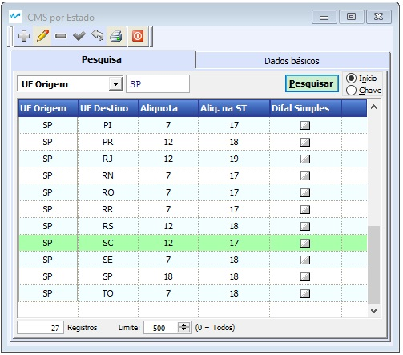
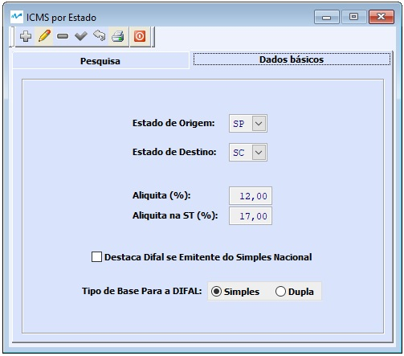

---
layout: default
---

##### Se ainda não conhece a estrutura de telas do sistema, clique em <a href="https://mpc2erp.github.io/Pages/Telas" target="_blank">Telas do Sistema MPC²-ERP</a>

# Cadastro ICMS por Estado

###### Esta funcionalidade é acionada na Opção Cadastros do Menu Principal, no Sub-Menu Fiscal
 
Neste cadastro são digitadas as configurações padrão do ICMS de um Estado de origem (Estado do Emitente) para um Estado de destino (Estado do Destinatário). 

Localize na tabela o Estado de Origem e Destino desejado e selecione

  

Ao selecionar será apresentada a tela para a configuração :

  

Neste cadastro serão indicados:
 - Alíquota Básica do ICMS para a operação entre os Estados.
 - Alíquota Básica do ICMS-ST para a operação entre os Estados.
 - Se destaca Difal para Emitentes Optantes do Simples Nacional.
 - O Tipo da Base para Cálculo do Difal, podendo ser Simples ou Dupla.
 
Para o bom funcionamento de um sistema, é imprescindível que as informações dos cadastros sejam de boa qualidade.
### Crie o hábito de realizar revisões periódicas nos seus cadastros.

##### A responsabilidade da correta parametrização das informações que acarretam na tributação de documentos fiscais, é do emissor dos documentos, não cabendo à MPC² Sistemas nenhuma responsabilidade por Notas Fiscai tributadas erradas por má parametrização. 
##### Todas as alterações ficam registradas como eram anteriormente, como ficaram e quem alterou.
