---
layout: default
---

##### Se ainda não conhece a estrutura de telas do sistema, clique em <a href="https://mpc2erp.github.io/Pages/Telas" target="_blank">Telas do Sistema MPC²-ERP</a>

# NF-e - Nota Fiscal Eletrônica
 
Nota Fiscal Eletrônica, a NF-e, é o documento fiscal de compra, venda remessa, importação, exportação, etc ... 

Para poder falar de Notas Fiscais, antes devem ser estudaos / conhecidos os seguintes assuntos abaixo listados. Abre a página clicando no assunto desejado:

<a href="https://mpc2erp.github.io/Pages/Natureza" target="_blank">Natureza das Operações</a> 

<a href="https://mpc2erp.github.io/Pages/ClasFis" target="_blank">Classificações Fiscais e Exceções do ICMS por Classificação Fiscal e Estado</a> 

<a href="https://mpc2erp.github.io/Pages/ICMS_UF" target="_blank">ICMS por Estado</a> 

<a href="https://mpc2erp.github.io/Pages/Clientes" target="_blank">Cadastro de Clientes</a> 

<a href="https://mpc2erp.github.io/Pages/Fornecedores" target="_blank">Cadastro de Fornecedores</a> 

A enorme maioria das NF-e´s emitidas por uma empresa, normalmente são (ou deveriam ser) Notas Fiscais de Vendas, que, raras exceções, nascem no Pedido de Vendas. Para saber como cadastrar uma Nota Fiscal a partir de um pedido de venda, clique em <a href="https://mpc2erp.github.io/Pages/Fornecedores" target="_blank">Pedidos de Venda</a>.

Como todas as telas do sistema, a Nota Fiscal abre pela tela de pesquisa, podendo pesquisar e consultar nostas a emitir ou também já emitidas por Empresa (matriz / Filiais), Número da Nota, Conhecimento de Transporte, Pedido, Data de Emissão, Data de Entrada / Saída, Razão Social, Fantasia ou CNPJ/CPF do Destinatário.

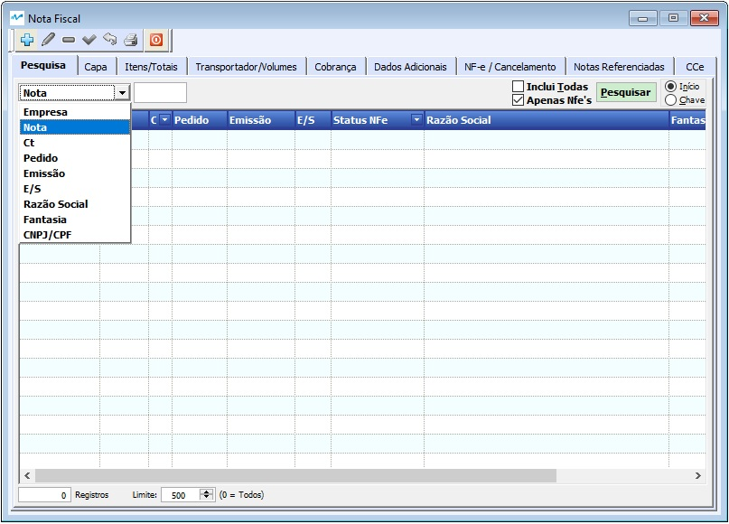 

Para poder incluir nas pesquisas as Notas Fiscias já emitidas, canceladas ou inutilizadas, é necessário MARCAR o Flag Inclui Todas.

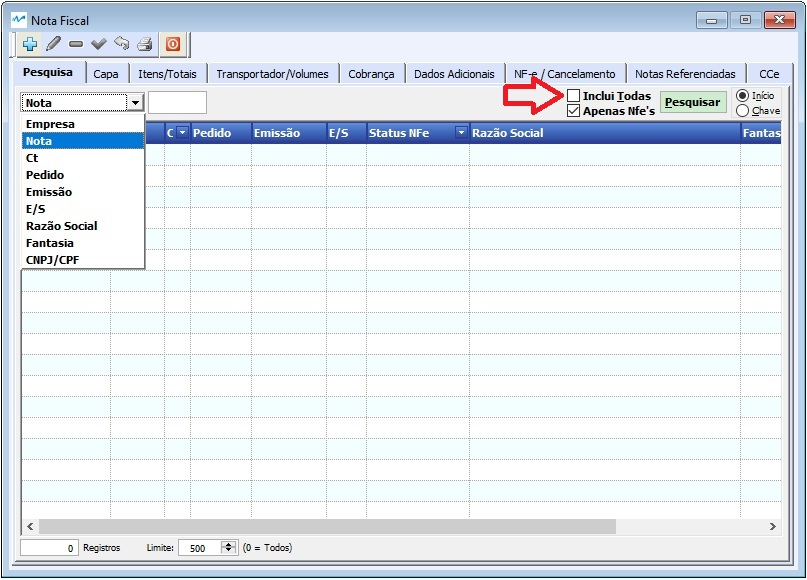 

Capa da Nota

Algumas informações fundamentais para a correta emissão de uma Nota Fiscal Eletrônica estão na Capa da Nota e devem ser observadas/informadas. São elas :

* Tipo da nota (Entrada ou Saída): Informa para o sistema o Tipo da Nota Fiscal e estabelece toda a gama possível de CFOP´s possíveis.
* Dados do Destinatário (Ou Emitente se Entrada): São as informações cadastrais do Destinatário (Nota de Saída) ou Emitente (Nota de Entrada), além de informações de vínculo com o Pedido de Venda.
* Naturezas Principal e secundária: São informações complementares de quais serão as CFOP´s mais utilizadas nesta Nota Fiscal. Essa informação NÃO restringe o número de CFOP´s qie podem ser utilizadas na Nota.
* Status da nota: Indica se o Documento é Ativo ou Cancelado
* Consumidor Final: Indica se os produtos da Nota são para Consumo ou Produção
* Contribuinte de ICMS: Indica se o Destinatário é contribuinte do ICMS.
* Finalidade da NFe: Indica se é uma NFé Normal, Complementar, Ajuste ou Devolução.
* Regime de Estimativa Simplificada e Alíquota, para clientes do MT.
* DI: Nº do Documento de Importação

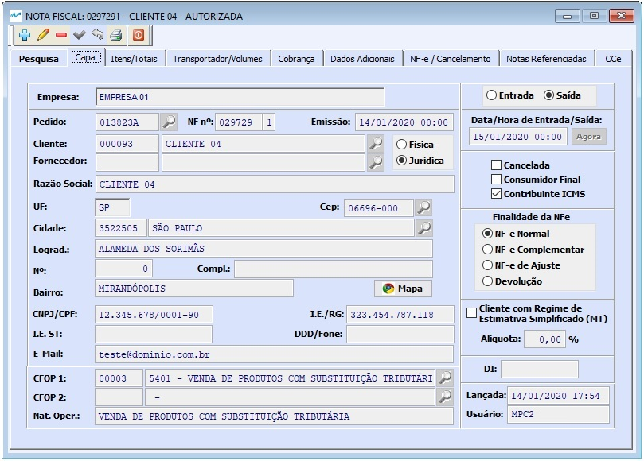 

Itens da Nota com Fechamento de Impostos

Esta tela fornece uma visão sintética do itens já incluidos na Nota, oferece as ferramnetas para poder alterar ou excluir itens ou incluir novos itens em documentos que ainda não foram homologados além da ferramenta para consulta de itens. Além disso, na parte inferior da tela, é exibido a totalização tributária deste documento.

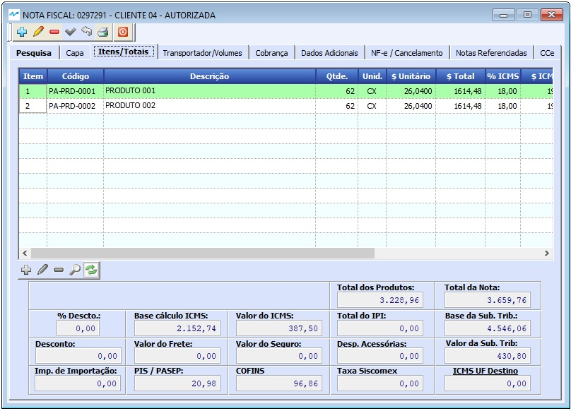 

Cadastro de Itens 

Esta tela é utilizada para inclusão, alteração ou consulta dos itens da nota. 
Ela é difidida em várias partes. 
A Primeia parte, ITEM (Azul marinho), apresenta o nº do item e recebe o Nº do Pedido do Cliente, Nº do Item do Item do Pedido do Cliente e a Natureza da Operação para este item.
Logo abaixo, a segunda parte, PRODUTO (em azul céu) recebe os dados do produto relacionado a este item, seus valores e quantidades.
Em DIVERSOS (verde) estão as informações de Valor de Frete, Seguro e Despesas Acessórias.

Na parte na cor Salmon, são tratados os impostos, dividido em várias abas: 

ICMS/ICMS ST onde são apresentadas as informações, valores e alíquotas que envolvem a tributação do ICMS e ICMS ST deste item.
    

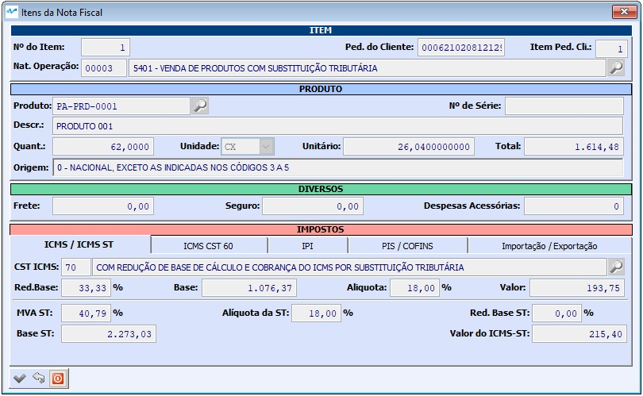 

Na aba ICMS na CST 60 são apresentadas as informações, valores e alíquotas que envolvem a tributação do ICMS do(s) item(ns) com a CST 60.

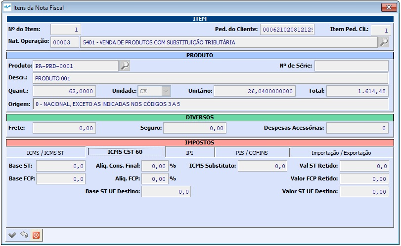 

Já na aba IPI, são apresentadas as informações, valores e alíquotas que envolvem a tributação do IPI, incluindo a Classificação Fiscal.

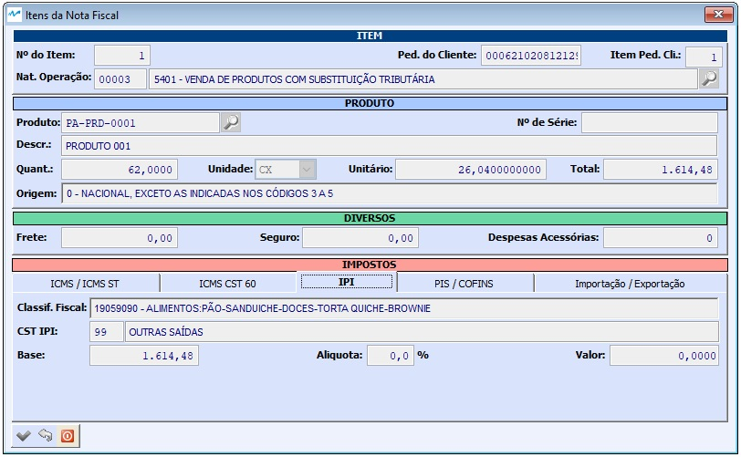 

Na sequência, a aba PIS/COFINS, as informações apresentadas, são classificações, valores e alíquotas que envolvem a tributação do PIS e do COFINS.

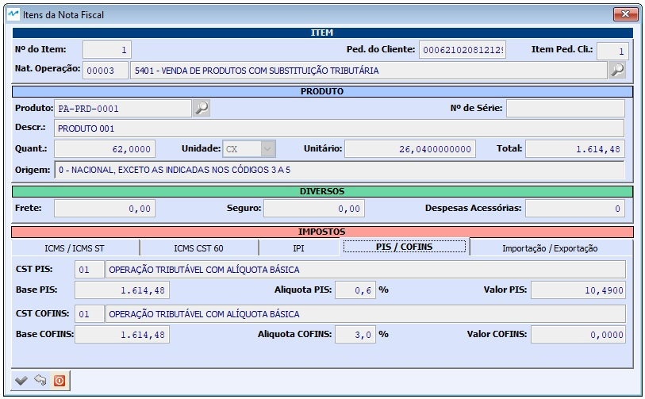 

Por fim, a aba de Detalhamento dos dados de Importação / Exportação, onde serão incluidos os dados de Adição de DI e os dados de DeawBack (quando necessário).

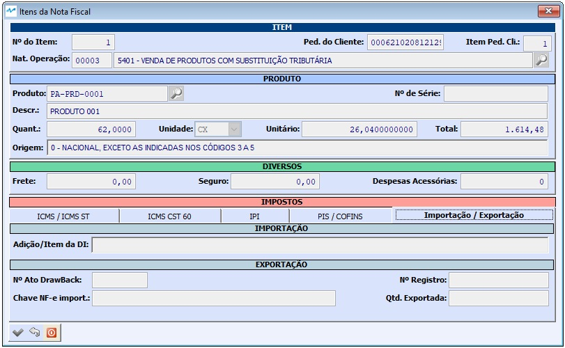 

Transporte / Volumes

Nesta aba são inseridas as informações sobre o transporte, o transportador, endereço de entrega, informações debre Volumes e dados de Exportação.

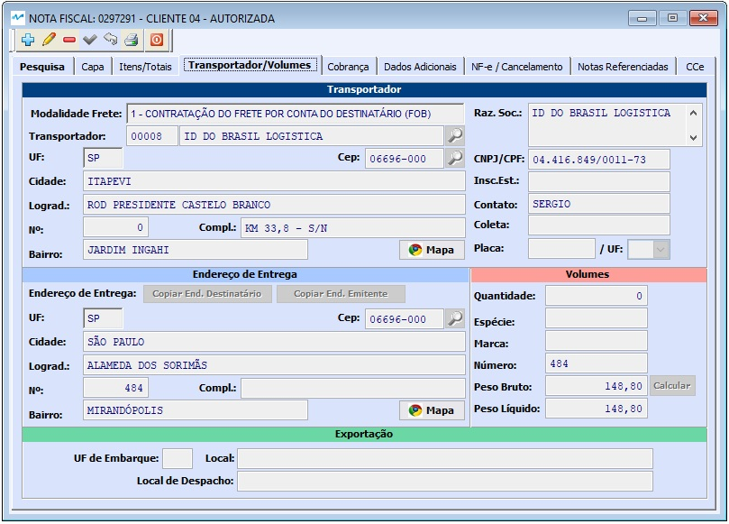 

Cobrança

As informações de Cobrança incluem a Forma e prazos de pagamento, detalhamento das parcelas, podendo elas serem divididas pelo total da nota ou pelo valor da mercadoria com tratamento diferenciado para o valor do IPI e do ICMS ST. Também é nesta tela que é informado, quando necessário, as informações de Endereço de Cobrança.

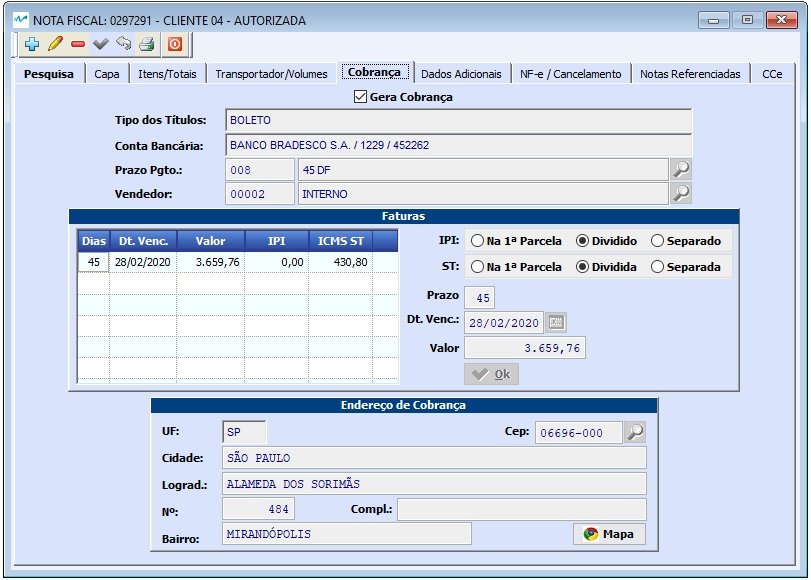 

Dados Adicionais

Esta aba é utilizada para incluir as informações complementares da Nota Fiscal, como decretos e leis que estajam sendo utilizadas na nota para tributação diferenciada, dados de devolução, informações de pedidos de venda, etc ...

 

NF-e / Cancelamento

Clique aqui para saber como funciona a parte de <a href="https://mpc2erp.github.io/Pages/Natureza" target="_blank">NF-e / Cancelamento</a> a

 

Notas Referenciadas

Alguma notas fiscais como as notas de devolução, exigem o Documento Refeenciado, que no caso de uma devolução, trata-se da Nota Fiscal de remessa. Este documento deve ser incluido nesta aba. O documento pode ser uma Nota Fiscal do tipo A1, que praticamente está extinta, principalmente no estado de São Paulo, NF-e que é a opção padrão ou Cupom Fiscal. 
Uma nota de devolução pode retornar materiais recebidos em Notas Fiscais distintas, por isso não há limite de documentos referenciados.

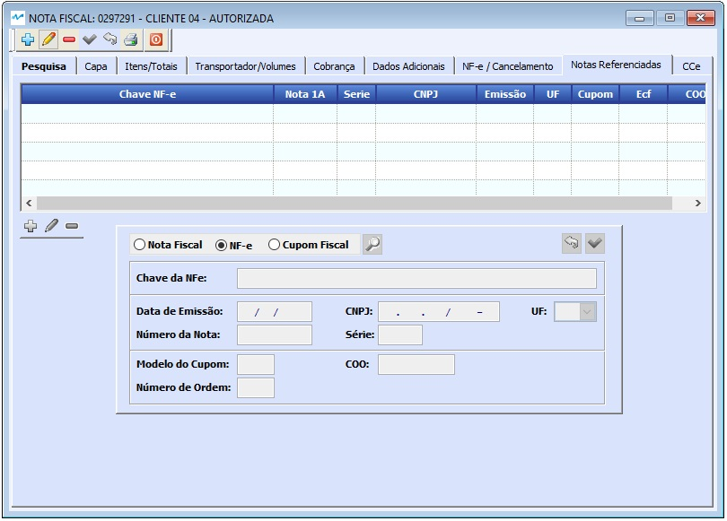 

Cartas de Correção

Algumas informações da Nota Fiscal podem ser corrigidas sem a necessidade de cancelamento do documento fiscal, através de uma Carta de de Correção Eletrônica, a CC-e. A pesar de trivial, não é algo que se deva fazer sem conceito ou sem consulta à contabilidade. Não há limite de Cartas de Correção para cada NF-e

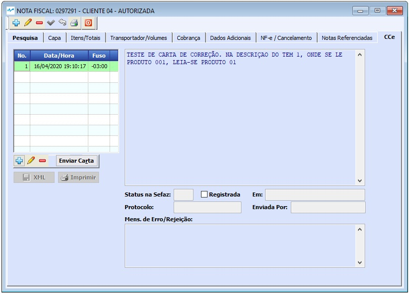 

