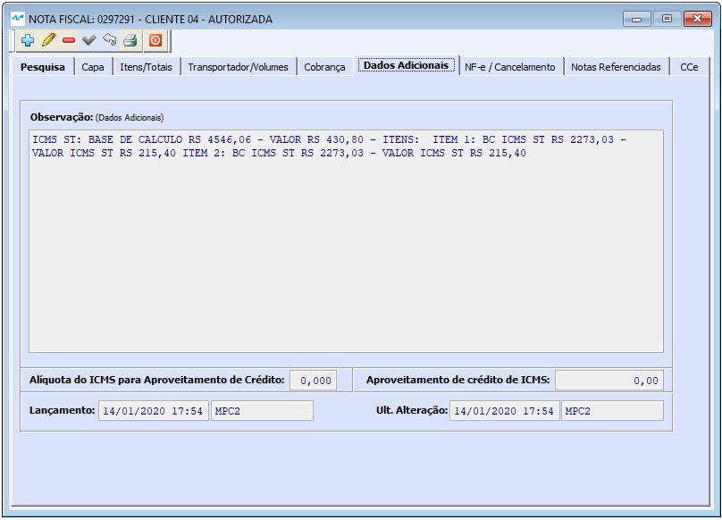

##### Se ainda não conhece a estrutura de telas do sistema, clique em <a href="https://mpc2erp.github.io/Pages/Telas" target="_blank">Telas do Sistema MPC²-ERP</a>

# NF-e - Nota Fiscal Eletrônica
 
Nota Fiscal Eletrônica, a NF-e, é o documento fiscal de compra, venda remessa, importação, exportação, etc ... 

Para poder falar de Notas Fiscais, antes devem ser estudaos / conhecidos os seguintes assuntos abaixo listados. Abre a página clicando no assunto desejado:

<a href="https://mpc2erp.github.io/Pages/Natureza" target="_blank">Natureza das Operações</a> 

<a href="https://mpc2erp.github.io/Pages/ClasFis" target="_blank">Classificações Fiscais e Exceções do ICMS por Classificação Fiscal e Estado</a> 

<a href="https://mpc2erp.github.io/Pages/ICMS_UF" target="_blank">ICMS por Estado</a> 

<a href="https://mpc2erp.github.io/Pages/Clientes" target="_blank">Cadastro de Clientes</a> 

<a href="https://mpc2erp.github.io/Pages/Fornecedores" target="_blank">Cadastro de Fornecedores</a> 

A enorme maioria das NF-e´s emitidas por uma empresa, normalmente são (ou deveriam ser) Notas Fiscais de Vendas, que, raras exceções, nascem no Pedido de Vendas. Para saber como cadastrar uma Nota Fiscal a partir de um pedido de venda, clique em <a href="https://mpc2erp.github.io/Pages/Fornecedores" target="_blank">Pedidos de Venda</a>.

Como todas as telas do sistema, a Nota Fiscal abre pela tela de pesquisa, podendo pesquisar e consultar nostas a emitir ou também já emitidas por Empresa (matriz / Filiais), Número da Nota, Conhecimento de Transporte, Pedido, Data de Emissão, Data de Entrada / Saída, Razão Social, Fantasia ou CNPJ/CPF do Destinatário.

 

Para poder incluir nas pesquisas as Notas Fiscias já emitidas, canceladas ou inutilizadas, é necessário MARCAR o Flag Inclui Todas.

 

Capa da Nota

Algumas informações fundamentais para a correta emissão de uma Nota Fiscal Eletrônica estão na Capa da Nota e devem ser observadas/informadas. São elas :

* Tipo da nota (Entrada ou Saída): Informa para o sistema o Tipo da Nota Fiscal e estabelece toda a gama possível de CFOP´s possíveis.
* Dados do Destinatário (Ou Emitente se Entrada): São as informações cadastrais do Destinatário (Nota de Saída) ou Emitente (Nota de Entrada), além de informações de vínculo com o Pedido de Venda.
* Naturezas Principal e secundária: São informações complementares de quais serão as CFOP´s mais utilizadas nesta Nota Fiscal. Essa informação NÃO restringe o número de CFOP´s qie podem ser utilizadas na Nota.
* Status da nota: Indica se o Documento é Ativo ou Cancelado
* Consumidor Final: Indica se os produtos da Nota são para Consumo ou Produção
* Contribuinte de ICMS: Indica se o Destinatário é contribuinte do ICMS.
* Finalidade da NFe: Indica se é uma NFé Normal, Complementar, Ajuste ou Devolução.
* Regime de Estimativa Simplificada e Alíquota, para clientes do MT.
* DI: Nº do Documento de Importação

 

Itens da Nota com Fechamento de Impostos

 

Cadastro de Itens com Detalhamento do ICMS e ICMS ST

 

Detalhamento do ICMS na CST 60

 

Detalhamento do IPI

 

Detalhamento do PIS/COFINS

 

Detalhamento dos dados de Importação / Exportação

 

Transporte / Volumes

 

Cobrança

 

Dados Adicionais

 

NF-e / Cancelamento

 

Notas Referenciadas

 

Cartas de Correção

 

