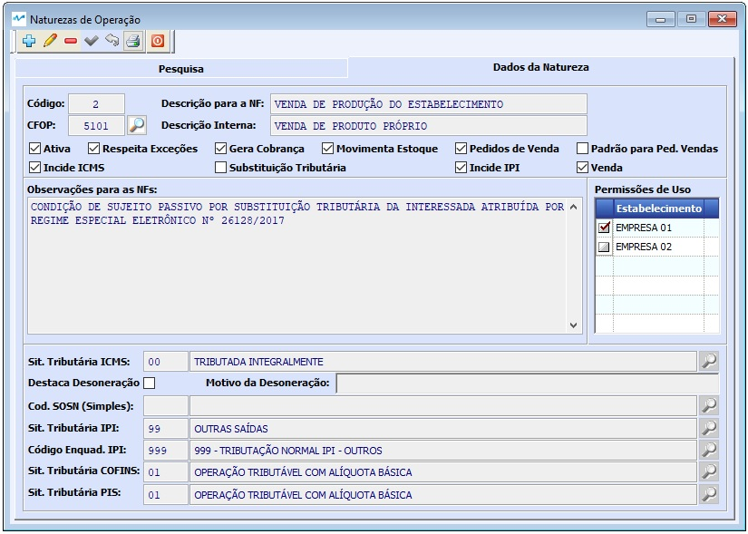
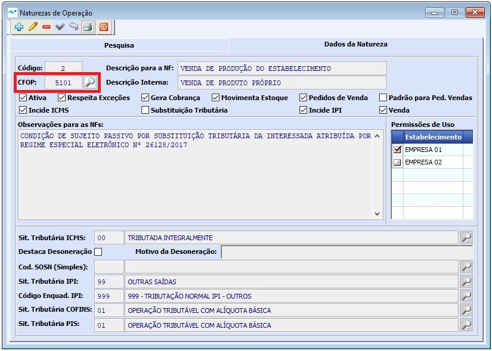

##### Se ainda não conhece a estrutura de telas do sistema, clique em 
##### <a href="https://mpc2erp.github.io/Pages/Telas" target="_blank">Telas do Sistema MPC²-ERP</a>

# Cadastro de Naturezas de Operação
 

O Cadastro de Naturezas de Operação é um Cadastro Chave para o bom funcionamento de Vendas, Faturamento, remessas, etc, pois é nele que se configura EXATAMENTE como as situações de de Cada Operação devem se comportar.

Este cadastro é muito importante e deve ser feito com critério, pois é nele que se define toda a parte tributária e legal de uma operação.

 

Uma Natureza de Operação está sempre ligada a uma CFOP e tudo que ela representa.
Repare no exemplo abaixo, usada para Vendas de produção própria dentro do estado, como está cadastrado e o que é cada informação.

 

A Operação (de venda, remessa, etc ...) segue aquilo que está parametrizado na Natureza para calcular impostos e tudo mais.

 

 

Para o bom funcionamento de um sistema, é imprescindível que as informações dos cadastros sejam de boa qualidade.
### Crie o hábito de realizar revisões periódicas nos seus cadastros.

