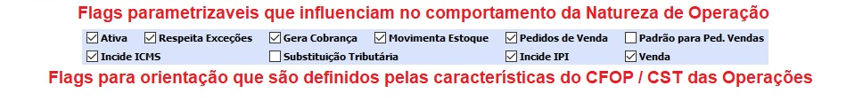

##### Se ainda não conhece a estrutura de telas do sistema, clique em <a href="https://mpc2erp.github.io/Pages/Telas" target="_blank">Telas do Sistema MPC²-ERP</a>

# Cadastro de Naturezas de Operações
 

O Cadastro de Naturezas de Operação é um Cadastro Chave para o bom funcionamento de Vendas, Faturamento, remessas, etc, pois é nele que se configura EXATAMENTE como as situações de de Cada Operação devem se comportar.

Este cadastro é muito importante, pois é nele que são definidos os padrões iniciais dos cálculos de tributos de uma operação.

É necessário conhecimento dos conceitos tributários envolvidos para que se trabalhe de maneira correta com as informações contidas em cada Natureza de Operação.
Recomendamos que seja acompanhado pelo(s) profissional(ais) do depatamento contábil ou escritório de contabilidade

 

Uma Natureza de Operação está sempre ligada a uma CFOP e tudo que ela representa. Porém pode-se ter mais de uma Natureza de Operação por CFOP.
Ao clicar no ícone de Lupa, apresentada ao lado do Código da CFOP, será apresentada a tabela das CFOP´s.
Repare no exemplo abaixo, usada para Vendas de produção própria dentro do estado, como está o cadastrado e o que representa cada informação.

 
   
A Operação (de venda, remessa, etc ...) segue aquilo que está parametrizado na Natureza para calcular impostos e tudo mais. 

 

Os Flags que podem ou devem ser alterados
   - Ativa : Indica se a Natureza está liberada para ser utilizada
   - Respeita Exceções : Indica se a Tributação segue os padrões definidos ou não
   - Gera Cobrança : Indica se a Operação deve gerar títulos financeiros ou não
   - Movimenta Estoque : Indica se os movimentos realizados com esta natureza movimentam o(s) estoque(s) dos produtos
   - Pedidos de Venda : Indica se a Natureza pode ser utilizada em Pedidos de Venda
   - Padrão para Ped. Vendas : Indica se é uma Natureza padrão para Vendas

São Flags meramente informativos:
   - Incide ICMS - Definido pela CST do ICMS
   - Incide IPI - Definido pela CST do IPI
   - Substituição Tributária - Definido pela CFOP e CST do ICMS
   - Venda - Definido pela CFOP

 

CST - O Código da Situação Tributária. São tabelas criadas pelo governo que estabelecem  regras tributárias para cada tributo. 
Nós da MPC² Sistemas nos baseamos rigorosamente nas regras tributárias definidas nas CSTs ou em suas exceções.
Para cada Natureza da Operaçãos, são devinidos os seguintes códigos:
   - CST do ICMS - Define o Comportamento básico para o cálculo do ICMS
   - Se há desoneração do ICMS e caso haja, qual o Motivo da Desoneração
   - CSOSN (Código da Operação para empresas do Simples). O Código SOSN é digitado para contemplar uma obrigação fiscal, porém não influencia nos calculos dos tributos, sendo obrigatório para o SISTEMA que a CST do ICMS seja preenchida, independente do regime tributário da empresa.
   - CST do IPI - Define o comportamento básico para o IPI
   - CST do COFINS - Define o comportamento básico para o COFINS
   - CST do PIS - Define o comportamento básico para o PIS

Cridas as Naturezas de Operação, devemos lembrar que muitas regras são básicas e passíveis de exceções. As exceções conhecidas até o momento, são sempre vinculadas a uma NCM (Nomenclatura Comum do Mercosul). Sendo assim, uma NCM pode ter várias situações tributárias diferentes. Este conjunto de informações chama-se Classificações Fiscais.

Conheça mais sobre as Classificações Fiscais clicando em <a href="https://mpc2erp.github.io/Pages/ClasFis" target="_blank">Classificações Fiscais</a>

Os parâmetros tem que seguir OBRIGATORIAMENTE as diretrizes da CST do ICMS. Ou seja, só nas CSTs que tratem ST ela será acatada. Só nas CSTs que tenham Redução de Base, elas poderão ser configuradas, etc ...

Nota Importante: As alterações das configurações tributárias NÃO alteram os documentos gerados anteriormente a mudança, e sim, apenas os novos documentos.

Para o bom funcionamento de um sistema, é imprescindível que as informações dos cadastros sejam de boa qualidade.
### Crie o hábito de realizar revisões periódicas nos seus cadastros.

##### A responsabilidade da correta parametrização das informações que acarretam na tributação de documentos fiscais, é do emissor dos documentos, não cabendo à MPC² Sistemas nenhuma responsabilidade por Notas Fiscai tributadas erradas por má parametrização. 
##### Todas as alterações ficam registradas como eram anteriormente, como ficaram e quem alterou.

