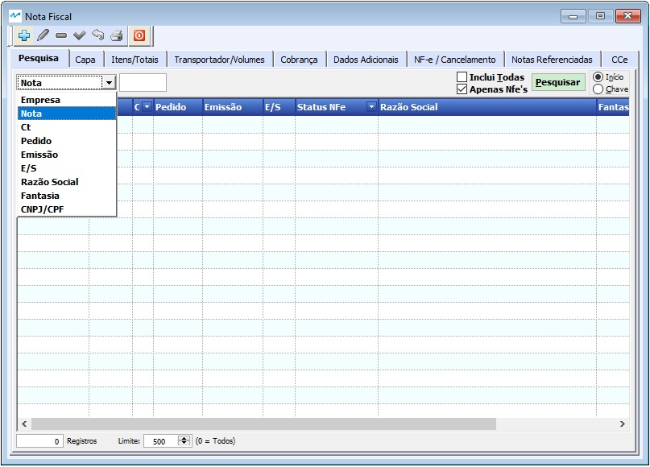
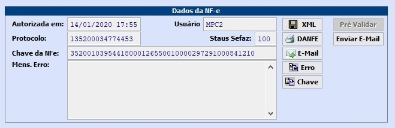
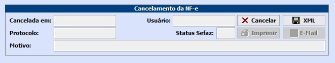
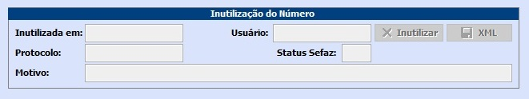
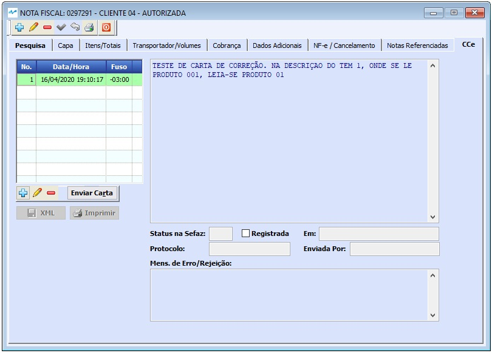

##### Se ainda não conhece a estrutura de telas do sistema, clique em <a href="https://mpc2erp.github.io/Pages/Telas" target="_blank">Telas do Sistema MPC²-ERP</a>

# NF-e - Nota Fiscal Eletrônica
 
Nota Fiscal Eletrônica, a NF-e, é o documento fiscal de compra, venda remessa, importação, exportação, etc ... 

Para poder falar de Notas Fiscais, antes devem ser estudaos / conhecidos os seguintes assuntos abaixo listados. Abre a página clicando no assunto desejado:

<a href="https://mpc2erp.github.io/Pages/Natureza" target="_blank">Natureza das Operações</a> 

<a href="https://mpc2erp.github.io/Pages/ClasFis" target="_blank">Classificações Fiscais e Exceções do ICMS por Classificação Fiscal e Estado</a> 

<a href="https://mpc2erp.github.io/Pages/ICMS_UF" target="_blank">ICMS por Estado</a> 

<a href="https://mpc2erp.github.io/Pages/Clientes" target="_blank">Cadastro de Clientes</a> 

<a href="https://mpc2erp.github.io/Pages/Fornecedores" target="_blank">Cadastro de Fornecedores</a> 

A enorme maioria das NF-e´s emitidas por uma empresa, normalmente são (ou deveriam ser) Notas Fiscais de Vendas, que, raras exceções, nascem no Pedido de Vendas. Para saber como cadastrar uma Nota Fiscal a partir de um pedido de venda, clique em <a href="https://mpc2erp.github.io/Pages/Fornecedores" target="_blank">Pedidos de Venda</a>.

Como todas as telas do sistema, a Nota Fiscal abre pela tela de pesquisa, podendo pesquisar e consultar nostas a emitir ou também já emitidas por Empresa (matriz / Filiais), Número da Nota, Conhecimento de Transporte, Pedido, Data de Emissão, Data de Entrada / Saída, Razão Social, Fantasia ou CNPJ/CPF do Destinatário.

 

Para poder incluir nas pesquisas as Notas Fiscias já emitidas, canceladas ou inutilizadas, é necessário MARCAR o Flag Inclui Todas.

 

Capa da Nota

Algumas informações fundamentais para a correta emissão de uma Nota Fiscal Eletrônica estão na Capa da Nota e devem ser observadas/informadas. São elas :

* Tipo da nota (Entrada ou Saída): Informa para o sistema o Tipo da Nota Fiscal e estabelece toda a gama possível de CFOP´s possíveis.
* Dados do Destinatário (Ou Emitente se Entrada): São as informações cadastrais do Destinatário (Nota de Saída) ou Emitente (Nota de Entrada), além de informações de vínculo com o Pedido de Venda.
* Naturezas Principal e secundária: São informações complementares de quais serão as CFOP´s mais utilizadas nesta Nota Fiscal. Essa informação NÃO restringe o número de CFOP´s qie podem ser utilizadas na Nota.
* Status da nota: Indica se o Documento é Ativo ou Cancelado
* Consumidor Final: Indica se os produtos da Nota são para Consumo ou Produção
* Contribuinte de ICMS: Indica se o Destinatário é contribuinte do ICMS.
* Finalidade da NFe: Indica se é uma NFé Normal, Complementar, Ajuste ou Devolução.
* Regime de Estimativa Simplificada e Alíquota, para clientes do MT.
* DI: Nº do Documento de Importação

 

Itens da Nota com Fechamento de Impostos

Esta tela fornece uma visão sintética do itens já incluidos na Nota, oferece as ferramnetas para poder alterar ou excluir itens ou incluir novos itens em documentos que ainda não foram homologados além da ferramenta para consulta de itens. Além disso, na parte inferior da tela, é exibido a totalização tributária deste documento.

 

Cadastro de Itens 

Esta tela é utilizada para inclusão, alteração ou consulta dos itens da nota. 
Ela é difidida em várias partes. 
A Primeia parte, ITEM (Azul marinho), apresenta o nº do item e recebe o Nº do Pedido do Cliente, Nº do Item do Item do Pedido do Cliente e a Natureza da Operação para este item.
Logo abaixo, a segunda parte, PRODUTO (em azul céu) recebe os dados do produto relacionado a este item, seus valores e quantidades.
Em DIVERSOS (verde) estão as informações de Valor de Frete, Seguro e Despesas Acessórias.

Na parte na cor Salmon, são tratados os impostos, dividido em várias abas: 

ICMS/ICMS ST onde são apresentadas as informações, valores e alíquotas que envolvem a tributação do ICMS e ICMS ST deste item.
    

 

Na aba ICMS na CST 60 são apresentadas as informações, valores e alíquotas que envolvem a tributação do ICMS do(s) item(ns) com a CST 60.

 

Já na aba IPI, são apresentadas as informações, valores e alíquotas que envolvem a tributação do IPI, incluindo a Classificação Fiscal.

 

Na sequência, a aba PIS/COFINS, as informações apresentadas, são classificações, valores e alíquotas que envolvem a tributação do PIS e do COFINS.

 

Por fim, a aba de Detalhamento dos dados de Importação / Exportação, onde serão incluidos os dados de Adição de DI e os dados de DeawBack (quando necessário).

 

Transporte / Volumes

Nesta aba são inseridas as informações sobre o transporte, o transportador, endereço de entrega, informações debre Volumes e dados de Exportação.

 

Cobrança

As informações de Cobrança incluem a Forma e prazos de pagamento, detalhamento das parcelas, podendo elas serem divididas pelo total da nota ou pelo valor da mercadoria com tratamento diferenciado para o valor do IPI e do ICMS ST. Também é nesta tela que é informado, quando necessário, as informações de Endereço de Cobrança.

 

Dados Adicionais

Esta aba é utilizada para incluir as informações complementares da Nota Fiscal, como decretos e leis que estajam sendo utilizadas na nota para tributação diferenciada, dados de devolução, informações de pedidos de venda, etc ...

 

NF-e / Cancelamento

Antes de continuar, o usuário tem que ter ciência de que, ao pré-validar ou tentar autorizar uma Nota FiscalEletrônica, este documento será numerado, será apresentado a Chave da Nota e, a partir deste momento, não poderá mais ser apagado. 
Antes de numerar, caso o usuário encontre alguma discrepância do resultado pretendido, a Nota em questão pode ser apagada, clicando no ícone menos (vermelho).
Quando uma Nota é criada automaticamente por um Pedido de Vendas, este fica bloqueado, e caso a Nota seja apagada (ou posteriormente cancelada) o referido pedido volta a ficar em aberto.

  

Esta aba se divide em três partes, sendo a primeira, Dados da NF-e, Cancelamento de NF-e e Inutilização do Número.

Na parte Dados da NF-e é onde as operações se concretizam para que o documento cadastrado venha (ou não) a se tornar uma Nota Fiscal Eletrônica. A tela mostra a Data da Autorização, o Usuário que submete-a à autorização, o nº do protocolo da SEFAZ e o Status SEFAZ. O Status SEFAZ é a informação que define se o documento em questão fou submetido e aprovado pela SEFAZ. Se o Status SEFAZ estiver em branco, é porque o documento ainda não foi submetido à autorização, e onde está o botão Enviar E-Mail estará ativo o botão Autorizar. Caso o Status SEFAZ seja 100, como no exemplo abaixo, a NF-e foi autorizada e se tornou Documento Fiscal. Os demais códigos de Status SEFAZ, indicam que o documento apresenta erros ou inconsistências e apresenta a menmsagem de erro da SEFAZ referente ao erro em questão.
Uma vêz autorizada, ficam ativos os seguintes ícones:

* XML:    Permite gravar o arquivo da NF-e em seu formato XML.
* DANFE:  Exibe o Documento Auxilixar de Nota Fiscal Eletrônica.
* E-Mail: Disapra um E-Mail para o titular da nota contendo XML e DANFE desta.
* Erro:   Copia para a Área de Transferência (Ctrl + C) a mensagem de erro.
* Chave:  Copia para a Área de Transferência (Ctrl + C) a Chave da NF-e.

  

Uma vez autorizada, a NF-e pode ser cancelada. Segundo as regras da SEFAZ, sem multa(s) por um período de 24 horas. Clicando na Opção Cancelar, que traz o X vermelho, será solicitado para o usuário, a justificativa do cancelamento, devendo este ter no mínimo 15 caracteres. Após a confirmação, o Status SEFAZ passa para 135.
Após o cancelamento da NF-e, o ícone Cancelar fica inativo, e são ativados os seguintes ícones:

* XML:    Permite gravar o arquivo do Cancelamento da NF-e em seu formato XML.
* DANFE:  Imprime um relatório de cancelamento de nota.
* E-Mail: Disapra um E-Mail para o titular da nota contendo XML deste cancelamento.

  

Quando um documento foi cadastrado e por algum motivo não será autorizado, o procedimento é a Inutilização da Numeração. Este procedimento cadastra o número em questão na SEFAZ como inutilizado.

  

Notas Referenciadas

Alguma notas fiscais como as notas de devolução, exigem o Documento Refeenciado, que no caso de uma devolução, trata-se da Nota Fiscal de remessa. Este documento deve ser incluido nesta aba. O documento pode ser uma Nota Fiscal do tipo A1, que praticamente está extinta, principalmente no estado de São Paulo, NF-e que é a opção padrão ou Cupom Fiscal. 
Uma nota de devolução pode retornar materiais recebidos em Notas Fiscais distintas, por isso não há limite de documentos referenciados.

 

Cartas de Correção

Algumas informações da Nota Fiscal podem ser corrigidas sem a necessidade de cancelamento do documento fiscal, através de uma Carta de de Correção Eletrônica, a CC-e. A pesar de trivial, não é algo que se deva fazer sem conceito ou sem consulta à contabilidade. Não há limite de Cartas de Correção para cada NF-e

 

