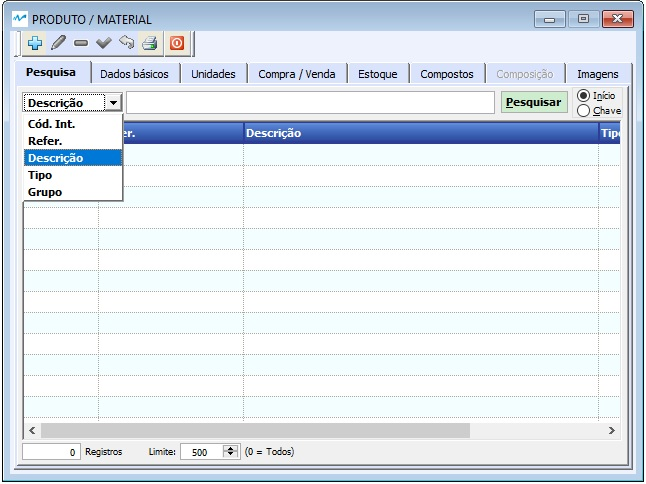

##### Se ainda não conhece a estrutura de telas do sistema, clique em <a href="https://mpc2erp.github.io/Pages/Telas" target="_blank">Telas do Sistema MPC²-ERP</a>

# Cadastro de Produtos
 
O Cadastro de Produtos, é um dos cadastros mais complexos e mais importantes para o correto funcionamento de qualquer Sistema. Deve ser elaborado por alguém que tenha conhecimento do assunto, treinado para o uso do sistema e seus recursos e, ainda com planejamento de um padrão a ser seguido para cada tipo de produto cadastrado.
É o local onde serão cadastrados e parametrizados TODOS os produtos e serviços utilizados e/ou prestados pela empresa. Tudo que se compra, tudo que se vende, e, tudo que se produz, item a item.

Para poder conhecer o Cadastro de Produtos, antes devem ser estudaos / conhecidos os seguintes Cadastros (abra a página clicando no assunto desejado) :

<a href="https://mpc2erp.github.io/Pages/TipoProd" target="_blank">Tipo de Produtos</a> 

<a href="https://mpc2erp.github.io/Pages/GrupoProd" target="_blank">Grupos de Produtos</a> 

<a href="https://mpc2erp.github.io/Pages/Unidades" target="_blank">Unidades de Medida</a> 

<a href="https://mpc2erp.github.io/Pages/ClasFis" target="_blank">Classificações Fiscais e Exceções do ICMS por Classificação Fiscal e Estado</a> 

<a href="https://mpc2erp.github.io/Pages/ICMS_UF" target="_blank">ICMS por Estado</a> 

<a href="https://mpc2erp.github.io/Pages/TabPreco" target="_blank">Tabelas de Preços</a> 

<a href="https://mpc2erp.github.io/Pages/Fases" target="_blank">Fases da Produção</a> 

A tela do Cadastro de Produtos é dividida em 8 abas, sendo as rotineiras Pesquisa e Dados Básicos seguidas ainda das abas Unidades, Compra / Venda, Estoque, Compostos, Composição e Imagens.

##### Aba Pesquisa

 

Um produto pode ser localizado pelo Código Interno, Referência, Descrição, Tipo ou ainda pelo Grupo de Produtos

##### Aba Dados Básicos

 

Na aba Dados básicos, quando se está cadastrando um novo produto, o Código do Produto, é uma informação numérica, sequencial, criada automaticamente pelo sistema a cada novo produto. 
Já a Referência o código do produto, definido pela empresa, alfanumérico, e é digitado pelo usuário. O sistema não permite que dois produtos usem a mesma referência. Como o código de referência é livre, as empresas podem adotar os mais diversos padrões de codificação.

Uma vez definida a referência, é hora de definir o <a href="https://mpc2erp.github.io/Pages/TipoProd" target="_blank">Tipo do Produtos</a>, ou seja, é neste ponto que se define se o tipo do Produto em questão, podendo ser:

    - Matéria Prima 
    - Material de Uso / Consumo
    - Material para Revenda
    - Produto Acabado (que será produzido pela empresa)
    - Intermediário (que será produzido pela empresa) 
    - Ativo Imobilizado 
    - Serviço 
    - Serviço de Terceiros
    , etc ... Todos os materias e serviços comprados, vendidos, revendidos ou produzidos devem ser cadastrados.

Na sequência, será definido o <a href="https://mpc2erp.github.io/Pages/GrupoProd" target="_blank">Grupos do Produtos</a>. Este Grupo do Produto é uma sub-categoria, que permite melhor setorização / divisão dos materiais, dentro de um Tipo. Por exemplo, em uma indústria de Alimentos, pode-se criar um grupo Farinhas Secas, Fermentos, Ingredientes Líquidos, etc ... Essa divisão ou não, fica a cargo da empresa

Após digitar a Descrição e os Detalhes do Produto, deve-se definir a Unidade de Inventário. A Unidade de inventário tem obrigatóriamente que estar cadastrada no <a href="https://mpc2erp.github.io/Pages/Unidades" target="_blank">Cadastro de Unidades de Medida</a>. É importante que seja selecionada com critério, pois, a pesar do sistema permitir operações com qualquer outras unidades relacionadas (Aba unidades), a Unidade de Inventário é considerada como principal, e os relatórios sempre tratam as informações a partir dela.

Código EAN e Código DUM-14 são os códigos de barras da Unidade e da Embalagem. Só deve ser preenchida quando a empresa utilizar essa informação em seus produtos, pois esse código é validado na(s) NF-e(s).

A <a href="https://mpc2erp.github.io/Pages/ClasFis" target="_blank">Classificação Fiscal</a> deve ser preenchida sempre com acompanhamento e anuência da Contabilidade, pois influenciam diretamente na tributação dos produtos.

Definida a Classificação Fiscal, é hora de definir a Origem do Produto, seguindo a tabela apresentada, que é fornecida pela SEFAZ.

Ainda nessa aba, na parte de baixo, sáo apresentadas duas informações importante. Quem cadastrou o produto, e caso ele tenha sido alterado, que foi o usuário que realizou a última alteração.

##### Lembrando qeu todas as alterações ficam registradas como eram anteriormente, como ficaram e quem alterou, de acorso com parametrização realizada pela MPC² Sistemas.

##### Aba Unidades

 

A Aba Unidades deve ser manipulada com conhecimento do que se está fazendo. Uma relação entre unidades cadastrada errada, pode comprometer seu inventário apresentando ao Fisco, uma informação não condizente com a realidade.
Todas as unidades que se desejar relacionar, tem obrigatóriamente que estar cadastrada no <a href="https://mpc2erp.github.io/Pages/Unidades" target="_blank">Cadastro de Unidades de Medida</a>.
Para inserir novas unidades, basta clicar no ícone de + abaixo da tabela, informar qual é a unidade a ser inserida, e Qual q Relação entre ela e a outra unidade, podento ser a de inventário ou qualquer outra já relacionada.

 

Nessa tela, nos Flag´s do lado esquerdo, informamos se essa relação está ativa, se essa unidade que está sendo incluída pode ser utilizada com Compra e/ou para Vendas desse material, e ainda se essa é a Unidade Tributável do Produto. Nos Flag´s do lado direito, observamos (não é possível alterar aqui) se essa é a Unidade de Inventário, se ela é a unidade padrão para Compras e/ou se é a unidade padrão para Vendas. Para quem usa, qual o código DUN-14 dessa unidade.
Podemos incluir informações de Altura, Larura e Comprimento, se for o caso, mas o principal ... A relação entre as unidades. No exemplo, uma Bomba de 100 litros equivale a 100 litros do produto.

 

Nesse exemplo, o Produto Thiner, tem como unidade principal o Litro, mas pode sem comprada em Lata de 1 litro, lata de 15 litros, bombona de 100 litros ou bombona de 200 litros, mas ela é utilizada nas formulações da empresa, em Quilos !! E um Kg de Thiner corresponde a 1,38313 Litros.

Uma particularidade do MPC²-ERP na parte de Unidades, é que quando uma unidade é relacionada, o sistema cria Automaticamente TODAS as relações possíveis entre TODAS as unidades. 

 

Isso não fica exposto por poder parecer complexo para os usuários, mas se clicar em Exibir Todas as Relações, na tabela de baixo da aba, são exibidas todas as relações possíveis entre as unidades, por exemplo, ao incluir a unidade KG, informamos que 1 KG equivale a 1,38313 Lts. Automaticamente o sistema já calculou que 1 litro pesa 0,723 (arredondando) Kg.

Até o momento não temos conhecimento de outro sistema com esta inteligência !

##### Aba Compra / Venda

 

As funcionalidsades desta aba, são importantes e demandam atenção. Na parte superior, estão as informações de Compras do Produto, para os casos em que o produto em questão é adquirido no mercado (MP / MC / Revenda / Etc ...). As informações definidas são: 
 - Unidade Padrão para Compras : Pode ser qualquer uma das unidades definidas na Aba Unidades, que estejam marcadas como Unidade para Compra. O Padrão é estabelecido para simplificar as compras, pois nos Pedidos de Compra, a unidade padrão para Compras de cada ítem é oferecida. Porém, é uma mera SUGESTÃO, podendo ser utilizada qualquer uma das unidades listadas.
 - Preço Padrão de Compra (Por UN): Este valor é definido manualmente, como referência, enquanto não há compras para o produto.
 - Ao clicar no botão Fornecedores, é apresentada uma tela com a tabela dos estabelecimentos que já forneceram o produto em questão. 
 
  

- Clicando no botão Compras, o sistema abre uma tela com o histórico de compras desse produto.

 

Na parte de baixo da tela, ficam as informações referentes a venda do produto em questão, para os produtos de Venda (Produção Própria) ou Revenda. Nesta parte, são digitadas as seguintes informações:
- Unidade Padrão para Vendas: Usando a mesma filosofia de Compras, aqui se define qual é a Unidade Padrão para Vendas. E, assim como em compras, trata de uma sugestão, podendo vender nas unidades listadas, marcadas como Unidade de Venda.
- Preço Básico de Venda (por UN): Esse é o preço ustilizado como Base para as <a href="https://mpc2erp.github.io/Pages/TabPreco" target="_blank">Tabelas de Preços</a> que utilizam porcentagem. Esse assunto deve ser cuidadosamente estudado e compreendido para um bom funcionamento.
- Quantidade Padrão de Venda: Essa informação atende empresas que não querem cadastrar outras unidades. Por exemplo, a unidade é PC, mas só vendo de cento e não quero trabalhar com a unidade CENTO ... Coloco a Quantidade Padrão como 100.
- Sua contabilidade deve fornecer uma tabela com quais estados exigem o FCP e qual a alíquota para aquele estado, e O Flag Contribui com o FCP (Fundo de Combate à Pobreza).
- Clicando no botão Preços, é apresentada uma tabela com Todas as Tabelas de Preços que permitem usar este produto. Para entender as informações apresentadas nesta tabela, é necessário ler e entender detalhadamente o funcionamento das <a href="https://mpc2erp.github.io/Pages/TabPreco" target="_blank">Tabelas de Preços</a>

- Quando clica no Botão Pedidos, o sistema oferece uma tabela com os Pedido de Venda que tem este produto, permitindo ao usuário ampla visão dos cenários de venda do produto. 

##### Aba Estoque

 

As informações desta Aba, configuram como o Estoque deste Produto deve ser tratado na empresa, parametrizando / informando os seguintes dados :

   - Flag Controla Estoque: 
        - Se o produto em questão tem seu estoque controlado ou não.
   - Flag Baixa Automática: 
        - Se o produto em quastão deve movimentar estoque automaticamente ou somente de forma manual.
   - Flag Saídas por Volume:
        - Se este produto irá utilizar a Saída por Volumes. O Conceito de saída por volumes está melhor esplicado no módulo Estoque, mas recomendamos orientação de um dos nossos consultores para perfeito entendimento.
   - Almoxarifado Padrão:
        - Apontamento do Almoxarifado Padrão (pré cadastrado) deste produto.
   - Endereço Padrão:
        - Indicação do Endereço (Estante / Prateleira / Caixa / Etc) em que fica o produto dentro do almoxarifado.
   - Produto Substituto:
        - Como o próprio título sugere, é onde se define qual produto pode ser vendido e/ou utilizado como alternativa ao produto em questão.
   - Prazo de Reposição:
        - É o prazo estimado para entrega do produto, quando adquirido.
   - Estoque Mínimo:
        - Quantidade Mínima que deve ter em estoque do produto em questão, considerando o Prazo de Entrega.
   - Estoque de Segurança:
        -  Muitas empresas preferem ter uma margem de segurança além do Estoque Mínimo. Quando este campo é preenchido, as Sugestões de Compra passa a considerá-lo ao invés do Estoque Mínimo.
   - Estoque Máximo
        - É a quantidade de referência para pedidos de compra. A Quantidade a ser adquirida é a diferença entre o Estoque Máximo e Estoque Mínimo ou Estoque de Segurança.
   
Nesta aba, ainda são apresentadas as informações da Posição do Estoque do produto.

   
##### Aba Compostos 

 
   
Esta ABA fica ativa apenas quando o Produto em foco é uma Materia Prima ou um Produto Semi-Acabado, e as informações exibidas são os produtos que utilizam este material em sua composição. 

##### Aba Composição

 

As empresas classificadas como Indústrias, trazem em seu portfolio os produtos que são produzidos e comercializados pela empresa. São os Produtos Acabados. Tem também os Produtos Intermediários, que assim como os Produtos Acabados, são manufaturados pela empresa, porém não são comercializadas e sim utilizadas em outros produtos.

É na aba Composição que os Produtos Acabados e Produtos Intermediários recebem sua estrutura de processos de produção e materiais utilizados em cada um deles.

As configurações são iniciadas com a indicação da quantidade final que formulação em questão deve produzir. Depois são incluídas as fases com o tempo estimado para esta produção, e dentro de cada fase, os materiais que serão utilizados e suas quantidades para esta produção.

Um composição mal planejada, impacta na apuração dos tempos de produção e sus custos, como também, quantidade de materiais. Por este motivo, recomendamos que a empresa contrate uma consultoria da MPC2 sistemas para dominarem o funcionamento , e também que a composição deva ser elaborada por um processista experiente.

##### Aba Imagens

 

Como o próprio nome sugere, é o local para inserir as imagens desejadas dos produtos. Mas devemos considerar alguns pontos. Se a empresa utiliza o SQL Express, ele é gratúito porém limitado a 10 gb de Banco de Dados, e não existe nada que consuma mais espaço em um Banco de Dados que IMAGENS !! Sendo assim, pondere se realmente há necessidade de ter a imagem neste produto, e se realmente há necessidade de colocar mais de uma, pois quando atinge o limite do Banco de Dados, você fica impetrado a comprar a versão FULL, o que representa um investimento suntuoso !!

