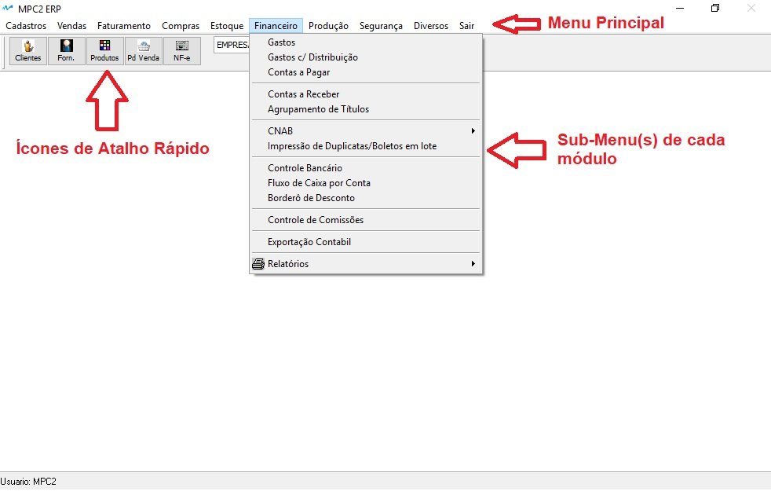
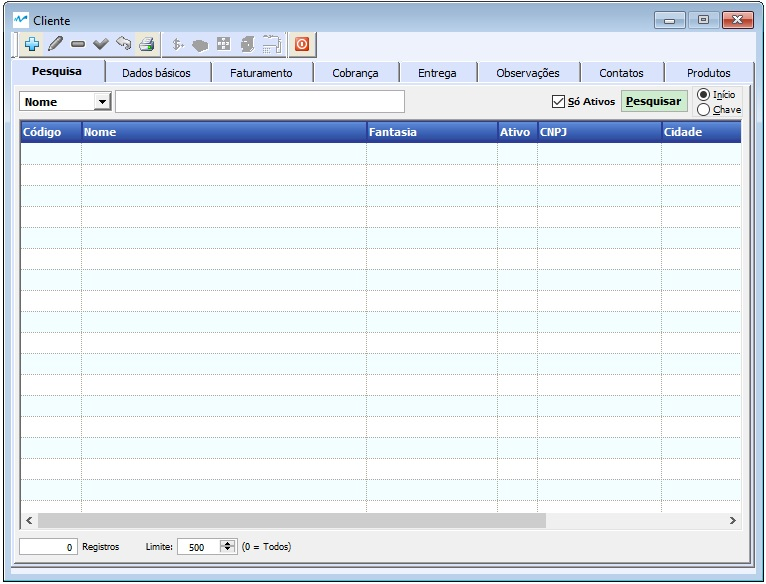
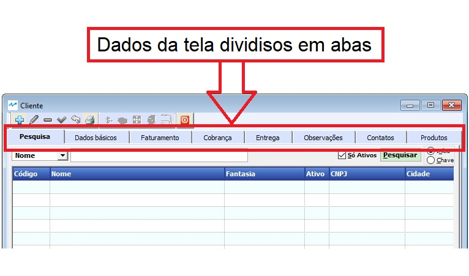
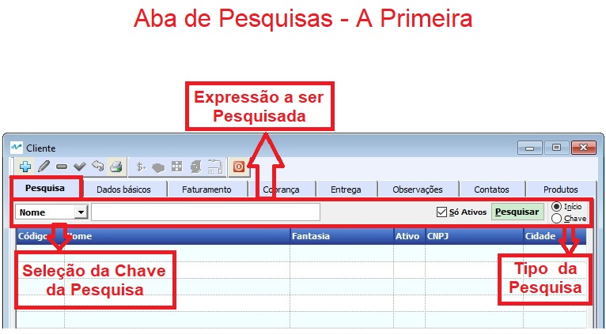
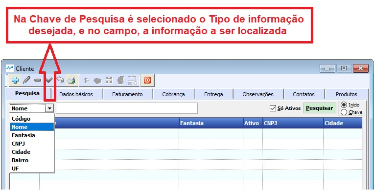
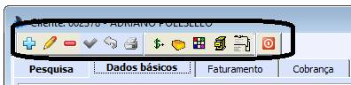
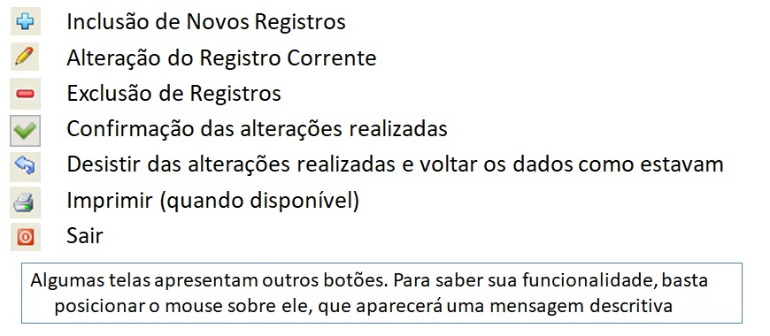

# Menus e Sub-Menus do Sistema MPC²-ERP

Após a entrada do nome de usuário e a senha, é apresentada a tela principal do sistema, onde, na parte de cima, são apresentadas as opções do menu do sistema e logo abaixo, os ícones de atalhos.

# Telas do Sistema MPC²-ERP

As telas do Sistema MPC²-ERP tem estrutura similar, onde procuramos agrupar todas as informações pertinentes ao que está sendo tratado em um mesmo local.

 

As telas são divididas em abas, sendo a primeira aba, a de **Pesquisa**, a segunda de **Dados Gerais**, e quando necessário, as demais abas dividindo outros tópicos.

  

Por padrão, quando se abre uma tela, ela já vem na ABA Pesquisa, para facilitar o trabalho de encontrar o registro desejado.

 

As pesquisas podem ser realizadas nas formas disponibilizadas pelo sistema.

 

Uma vez selecionado um registro, os Dados Gerais deste serão exibidos. 

As telas apresenta, vários ícones (repare nos ícones assinalados abaixo). São as ferramentas para Incluir, Alterar, Excluir, Etc...

## Função dos Botões :

Para o bom funcionamento de um sistema, é imprescindível que as informações dos cadastros sejam de boa qualidade.
### Crie o hábito de realizar revisões periódicas nos seus cadastros.

