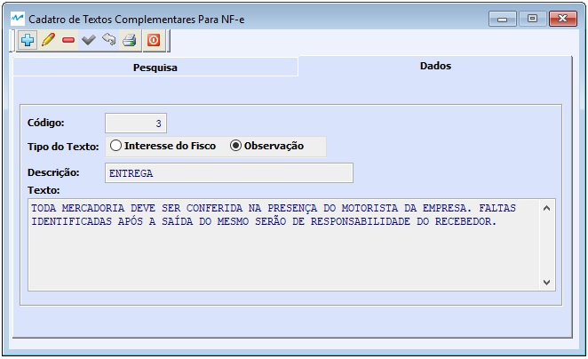

---
layout: default
---

##### Se ainda não conhece a estrutura de telas do sistema, clique em <a href="https://mpc2erp.github.io/Pages/Telas" target="_blank">Telas do Sistema MPC²-ERP</a>

# Cadastro de Textos Complementares para NF-e
 
Os textos complementares são uma grande ajuda para que se tenha registrado textos que são padrão para NF-e, para que não seja necessário sua digitação completa a cada nota. 

É um cadastro simples com o objetivo de textos pré definidos já cadastrados. 

  

Neste cadastro indicamos:
 - Em qual TAG este texto deverá constar, podendo ser Texto de Interesse do Fisco ou Observações, que são Textos de Interesse do Contribuinte.
 - Uma descrição interna para fácil localização nas pesquisas.
 - O Texto a ser armazenado.
 
Nota Importante: As alterações dos Textos Complementares para NF-e NÃO alteram os documentos gerados anteriormente a mudança, e sim, apenas os novos documentos.

Para o bom funcionamento de um sistema, é imprescindível que as informações dos cadastros sejam de boa qualidade.
### Crie o hábito de realizar revisões periódicas nos seus cadastros.

##### A responsabilidade da correta parametrização das informações que acarretam na tributação de documentos fiscais, é do emissor dos documentos, não cabendo à MPC² Sistemas nenhuma responsabilidade por Notas Fiscai tributadas erradas por má parametrização. 
##### Todas as alterações ficam registradas como eram anteriormente, como ficaram e quem alterou.
