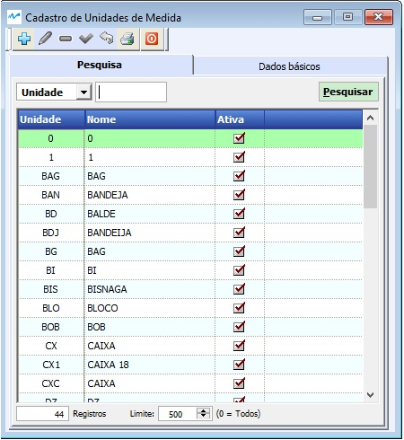
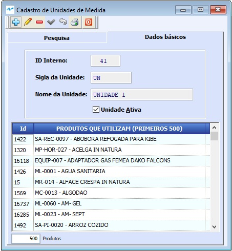

---
layout: default
---

##### Se ainda não conhece a estrutura de telas do sistema, clique em <a href="https://mpc2erp.github.io/Pages/Telas" target="_blank">Telas do Sistema MPC²-ERP</a>

# Cadastro De Unidades de Medida

###### Esta funcionalidade é acionada na Opção Cadastros do Menu Principal, no Sub-Menu Estoque
 
Neste cadastro são inseridas todas as unidades de medida utilizadas pela empresa. Não existe limite de unidades, porém a SEFAZ limita as siglas, que não podem ser repetidas, a três dígitos. 

O Sistema MPC²-ERP dá ampla versatilidade ao uso de unidades, podendo criar relações entre elas, produto a produto. As obrigações são apenas duas. A primeira, que as unidades estejam cadastradas, e a segunda, que o usuário tenha conhecimento do que está fazendo, na hora de estabelecer uma relação entre duas unidades, pois tratam unidades de Matérias Primas, Materiasi de Consumo, Produtos Acabados e Intermediários, etc ...

  

Ao selecionar, será apresentada a tela de cadastro :

  

Nesta tela é definida a Sigla da unidade, sua Descrição (Nome da Unidade) e se esta unidade está Ativa ou não
Também é exibido nesta tela, uma tabela com os produtos que as utilizam.
 
Para o bom funcionamento de um sistema, é imprescindível que as informações dos cadastros sejam de boa qualidade.
### Crie o hábito de realizar revisões periódicas nos seus cadastros.

##### A responsabilidade da correta parametrização das informações que acarretam na tributação de documentos fiscais, é do emissor dos documentos, não cabendo à MPC² Sistemas nenhuma responsabilidade por Notas Fiscai tributadas erradas por má parametrização. 
##### Todas as alterações ficam registradas como eram anteriormente, como ficaram e quem alterou, de acorso com parametrização realizada pela MPC² Sistemas.
