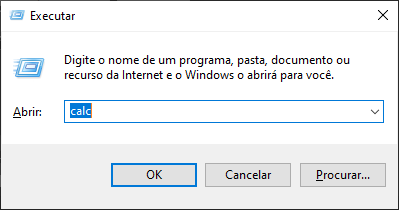

# Documentação da janela EXECUTAR do Windows

Para realizar a execução de um comando no windows deve-se realizar o seguinte procedimento.

Pressione simultaneamente no teclado as seguintes teclas: `WIN+R`

A seguinte janela será exibida na interface do usuário:

